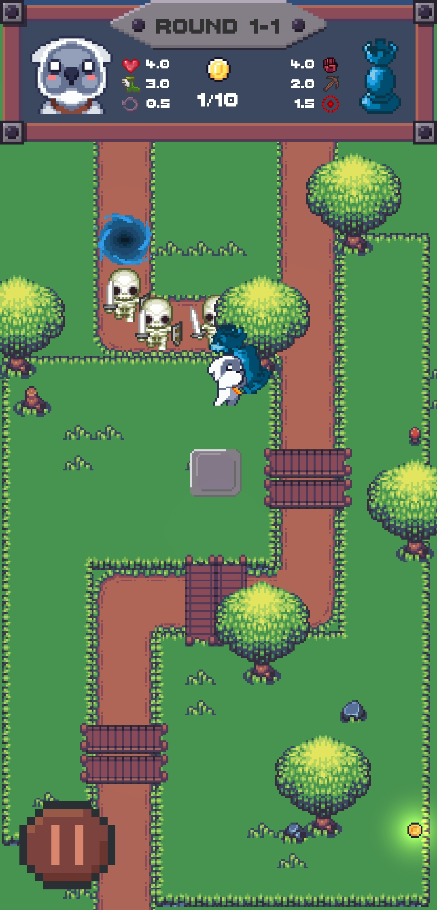

# Put-Pick Tower
First project game of GameDevClub (HCMUT). We remake Tower Bag game (GMTK Game Jam 2019) for practice.

## About this game
<b>Put-Pick Tower</b> is a special tower defense game. Without building tower to defense monster, your job is putting tower at position where monsters pass and picking tower to have more speed to collect coin faster. Balancing between putting and picking tower to defeat all monster and win the game.

## Categories
- GamePlay: <b>Tower defense, Co-operate, ...</b>
- Graphics: <b>2D, Pixel art, Top-down vision, ...</b>

## Screenshots

|||
|------------|-------------|
|||
|||
|||

## Sources
- Character art: [Pixel Art Tiny Hero Sprites][1]
- Tile set: [The Field of the Floating Islands][2]
## Author
- VTS Team:
    - <b>Nguyen Hoang Viet</b>
    - Nguyen Luong Hoai Son
    - Do Minh Tam
- Please contact us at: viet.nguyen2000@hcmut.edu.vn

---
[1]: https://craftpix.net/freebies/free-pixel-art-tiny-hero-sprites/
[2]: https://opengameart.org/content/the-field-of-the-floating-islands